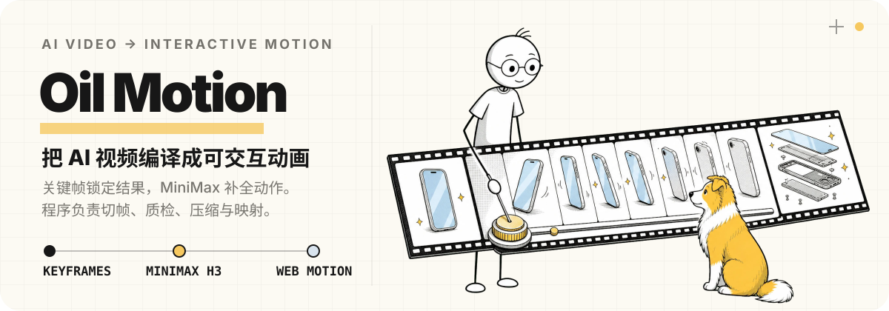

<p align="center">
  
</p>

Oil Motion 是一个 Agent 通用的交互动画 Skill。你只需要说明想让什么动、希望用户如何控制，Agent 会完成从画面设计、动画生成到网页接入的整个过程。

## 演示

https://github.com/user-attachments/assets/08e26ad6-ca23-4f31-ac53-44c7692ba99d

## 安装

告诉 Agent：帮我安装「https://github.com/oil-oil/oil-motion」这个 Skill。

## 它能做什么

- 页面向下滚动时，产品逐步展开、拆解或切换状态。
- 鼠标移动时，角色、宠物或产品自然地看向当前位置。
- 拖动进度时，让动画准确跟随手势前进或后退。
- 在手机上使用触摸或设备方向控制动画。
- 让动画自己播放，同时保留点击、悬停和页面状态的响应。

它不只负责“让画面动起来”，还会考虑动作是否自然、资源是否清晰、页面是否流畅，以及移动端是否可用。

## 整个过程

```text
告诉 Agent 你想表达什么
  ↓
先生成几张关键画面，确认角色、产品和动作方向
  ↓
把确认过的画面连接成一段完整动画
  ↓
自动删除停顿、重复和异常画面，并控制文件大小
  ↓
把动画接入滚动、鼠标、拖动、触摸或手机方向
```

简单来说：先把重要画面确认好，再生成它们之间的动作，最后把动画变成用户可以控制的网页效果。你不需要提前了解视频切帧、图集或浏览器动画技术。

## 快速开始

如果已经有想法和素材，可以直接说：

```text
使用 $oil-motion，把这两张产品图做成随页面滚动逐步展开的动画。
画面要保持清晰，手机上也要流畅。
```

如果还没有具体方案，也可以让 Agent 先帮你想：

```text
使用 $oil-motion，为这个产品首页设计一个有明确表达目的的交互动画。
先给我三个简单方向，说明每个方向适合表达什么，再选择一个开始制作。
```

## 常见场景

| 你想实现的效果 | 适合的控制方式 |
| --- | --- |
| 产品随着阅读逐步展开或拆解 | 页面滚动 |
| 角色看向用户、物体跟随光标 | 鼠标移动 |
| 自由查看产品结构或动画进度 | 拖动 |
| 手机上的直接操控 | 触摸 |
| 画面随着手机倾斜改变方向 | 设备方向 |
| 点击后切换动作或状态 | 点击与组件状态 |

## 你会得到什么

根据项目需要，Agent 会交付其中一部分或全部内容：

- 可以继续修改的原始画面和动画母版。
- 已整理、压缩并适合网页加载的动画资源。
- 可以直接接入项目的交互代码。
- 用来检查每一帧和当前交互状态的预览页面。
- 对加载速度、移动端和低动态偏好的处理。

最终格式由实际展示尺寸和交互方式决定。目标不是追求最小文件，而是在画面清晰的前提下，让加载和操作保持流畅。

## 怎样保证效果自然

- 开始生成前，先确认角色、产品、构图和重要动作。
- 动画完成后，检查是否有闪烁、停顿、重复部件或比例变化。
- 把效果放进真实页面测试，不只在单独的视频里查看。
- 鼠标快速移动、滚动和反向操作时，动画也应保持稳定。
- 资源尚未加载或用户关闭动态效果时，仍然显示合适的静态画面。

程序可以帮助整理和优化动画，但无法把错误的动作变成正确的动作。重要画面越明确，最后的结果越稳定。

## 第一次使用

第一次需要生成动画时，Agent 会引导你配置所需的 API Key。密钥只保存在本机，之后会自动读取，不需要重复输入。

## 更多细节

如果你需要了解提示词、生成参数、资源处理脚本或网页接入方式，可以继续查看 [`SKILL.md`](./SKILL.md) 和 [`references/`](./references/)。这些技术细节不会影响日常使用。

## License

[MIT](./LICENSE)
